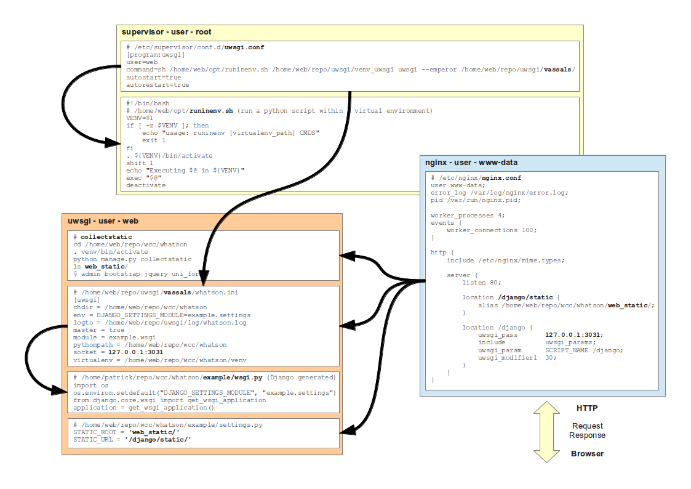

Links
*****

- :doc:`../../python/wsgi/uwsgi/links`
- :doc:`../../python/wsgi/uwsgi/install`
- :doc:`../../python/apps/supervisor/supervisor`

Learning
========

- `Jacob Kaplan-Moss - django-deployment-workshop`_ and
  `Video of django-deployment-workshop`_
- `Django in Production: Part 1 - The Stack`_
- `Try Redis instead`_
- `Basic Django deployment with virtualenv, fabric, pip and rsync`_
- `Provisioning a new Ubuntu server for Django`_
- `Running Django with Postgres, Nginx, and FastCGI on Ubuntu 10.4`_
- `Using virtualenv, pip and django-site-gen to quickly start new projects`_
- `django-site-gen`_ by Charles Leifer.

Fabric
======

- `Andrew Badr's django-fabfile`_, Fabfile for Deploying django with Nginx,
  Apache mod_wsgi, Postgres, and Postfix

Gunicorn
========

- :doc:`../../python/wsgi/gunicorn/links`
- :doc:`../../python/wsgi/gunicorn/django`

Nginx
=====

- `Hosting Django under different locations with Nginx and gunicorn`_

Tools
=====

- https://github.com/gcollazo/Fabulous
  Deploy django apps to Amazon EC2 with ONE command.

WSGI
====

- python WSGI links... :doc:`../../python/wsgi/links`
- `mod_wsgi - Integration With Django`_
- `Multiple django applications with mod_wsgi`_
- `slicehost - Ubuntu Hardy - Using mod_wsgi to Serve Your Application`_

.. _`Andrew Badr's django-fabfile`: https://github.com/reverie/django-fabfile/blob/master/fabfile.py
.. _`Jacob Kaplan-Moss - django-deployment-workshop`: http://github.com/jacobian/django-deployment-workshop/
.. _`Basic Django deployment with virtualenv, fabric, pip and rsync`: http://www.caktusgroup.com/blog/2010/04/22/basic-django-deployment-with-virtualenv-fabric-pip-and-rsync/
.. _`Django in Production: Part 1 - The Stack`: http://www.robgolding.com/blog/2011/11/12/django-in-production-part-1---the-stack/
.. _`Provisioning a new Ubuntu server for Django`: http://brandonkonkle.com/blog/2010/jun/25/provisioning-new-ubuntu-server-django/
.. _`Running Django with Postgres, Nginx, and FastCGI on Ubuntu 10.4`: http://blog.kevin-whitaker.net/post/725558757/running-django-with-postgres-nginx-and-fastcgi-on
.. _`Using virtualenv, pip and django-site-gen to quickly start new projects`: http://charlesleifer.com/blog/using-virtualenv-pip-and-django-site-gen-to-quickly-start-new-django-projects/
.. _`mod_wsgi - Integration With Django`: http://code.google.com/p/modwsgi/wiki/IntegrationWithDjango
.. _`Multiple django applications with mod_wsgi`: http://forum.webfaction.com/viewtopic.php?id=2400
.. _`slicehost - Ubuntu Hardy - Using mod_wsgi to Serve Your Application`: http://articles.slicehost.com/2009/9/3/ubuntu-hardy-using-mod_wsgi-to-serve-your-application
.. _`Try Redis instead`: http://unfoldthat.com/2011/09/14/try-redis-instead.html
.. _`Hosting Django under different locations with Nginx and gunicorn`: http://albertoconnor.ca/blog/2011/Sep/15/hosting-django-under-different-locations
.. _`django-site-gen`: https://github.com/coleifer/django-site-gen
.. _`Video of django-deployment-workshop`: http://blip.tv/pycon-us-videos-2009-2010-2011/django-deployment-workshop-3651591
