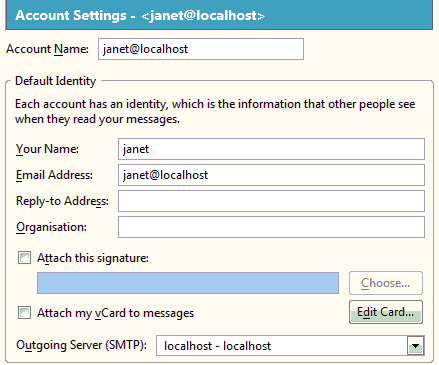

James - Testing
***************

Setup
=====

James
-----

From the *Configuration notes*, :doc:`config`, follow the *Prepare*, and
*Users* steps, creating the 3 users, ``janet``, ``john`` and ``switch``.

- ``janet`` and ``john`` are standard users, which will access the mail server
  using a standard mail client (in this example Mozilla Thunderbird,
  :doc:`../../../mozilla/thunderbird`.
- ``switch`` represents a mail agent, which we can use to test automated mail
  systems e.g. web site subscription requests...

Thunderbird
-----------

- Set-up the SMTP server, *Server Name*: ``localhost``, *Port*: ``25``:

- Create two pop3 accounts, one for Janet and one for John:

**Note**: Make sure you select the SMTP server on ``localhost``.
