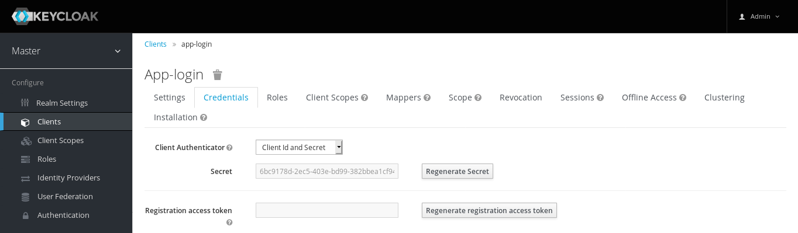

Keycloak
********

Docker
======

::

  docker run --name keycloak -e KEYCLOAK_USER=admin -e KEYCLOAK_PASSWORD=letmein -p 8443:8443 jboss/keycloak

Browse to:
https://localhost:8443/auth

To add a user (cannot find a way to add the email address)::

  docker exec 5be9949528f4 /opt/jboss/keycloak/bin/add-user-keycloak.sh -u patrick -p letmein
  # list containers
  docker ps -aq
  # e.g. 5be9949528f4
  # restart the container
  docker restart 5be9949528f4

Configure OIDC (OpenID Connect)
-------------------------------

*Configure*, *Clients*...

- *Client ID* (e.g. ``app-login``),
- *Client Protocol*: ``openid-connect``
- *Access Type*: ``confidential``
- Click on the *Credentials* tab to get the *Secret*...

Client
------

For the client, you need the `Keycloak Server OIDC URI Endpoints`_.
e.g. for the ``master`` realm, lookup this URL to find the endpoints:

https://localhost:8443/auth/realms/master/.well-known/openid-configuration

e.g.

- https://localhost:8443/auth/realms/master/protocol/openid-connect/token
- https://localhost:8443/auth/realms/master/protocol/openid-connect/auth
- https://localhost:8443/auth/realms/master/protocol/openid-connect/logout
- https://localhost:8443/auth/realms/master/protocol/openid-connect/userinfo

Here is a sample ``.private`` file for a Django project using
https://mozilla-django-oidc.readthedocs.io/

::

  set -x OIDC_OP_TOKEN_ENDPOINT "https://localhost:8443/auth/realms/master/protocol/openid-connect/token"
  set -x OIDC_OP_AUTHORIZATION_ENDPOINT "https://localhost:8443/auth/realms/master/protocol/openid-connect/auth"
  set -x OIDC_OP_JWKS_ENDPOINT "https://localhost:8443/auth/realms/master/protocol/openid-connect/certs"
  set -x OIDC_OP_USER_ENDPOINT "https://localhost:8443/auth/realms/master/protocol/openid-connect/userinfo"
  set -x OIDC_OP_LOGOUT_URL_METHOD "https://localhost:8443/auth/realms/master/protocol/openid-connect/logout"

  set -x OIDC_RP_CLIENT_ID "app-login"
  set -x OIDC_RP_CLIENT_SECRET "6bc9178d-2ec5-403e-bd99-382bbea1cf94"
  set -x OIDC_VERIFY_JWT "True"
  set -x OIDC_RP_SIGN_ALGO "RS256"
  # certificate is generated locally
  set -x OIDC_VERIFY_SSL "False"

.. tip:: Using the default configuration will only work if the user in Keycloak
         has the same email address as the Django user.

.. _`Keycloak Server OIDC URI Endpoints`: https://www.keycloak.org/docs/latest/server_admin/index.html#keycloak-server-oidc-uri-endpoints
