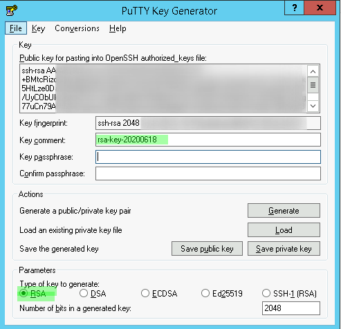
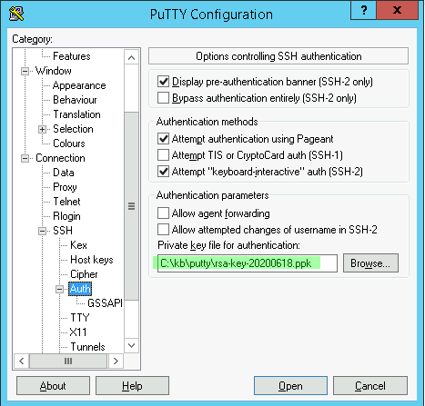
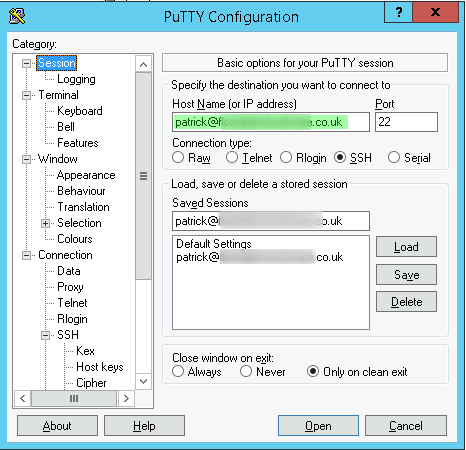
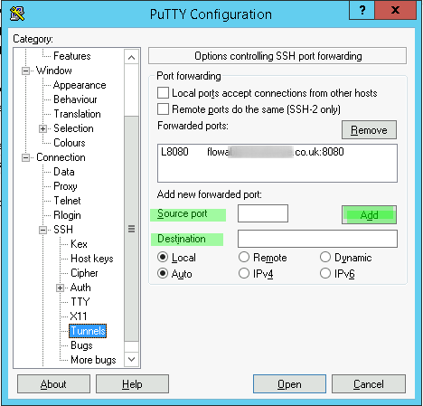

putty
*****

Links
=====

- :doc:`keys`
- `PuTTY Download Page`_
- `Key-Based SSH Logins With PuTTY`_
- `Secure Linux/UNIX access with PuTTY and OpenSSH`_

Utility
-------

- `PuTTY Tray`_
- `Customizing color schemes in PuTTY`_

ssh
===

- Download ``puttygen.exe`` from the putty download page:
  http://www.chiark.greenend.org.uk/~sgtatham/putty/download.html
- Run ``puttygen.exe`` (it has no installer):
- Select *Type of key to generate*, ``RSA``

.. note:: 18/01/2020, I can't get ``Ed25519`` working with Ubuntu 18.04.
          I get errors like this::

            sshd[1556]: rexec line 15: Deprecated option UsePrivilegeSeparation
            sshd[1556]: rexec line 18: Deprecated option KeyRegenerationInterval
            sshd[1556]: rexec line 19: Deprecated option ServerKeyBits
            sshd[1556]: rexec line 30: Deprecated option RSAAuthentication
            sshd[1556]: rexec line 37: Deprecated option RhostsRSAAuthentication

- *Generate* the key pair.  Do not enter a *passphrase* or you will need to
  enter the password each time you want to use the key.

- Save a copy of the
  *Public key for pasting into OpenSSH authorized_keys file* using the
  *Key comment* as the name with an extension of ``authorized_keys.txt``.
- Save the public key, using the
  *Key comment* as the name with an extension of ``pub``.
- Save the private key, using the
  *Key comment* as the name with an extension of ``ppk``.

.. tip:: The following steps must be done for the user which you will be using
         for the password-less login.

- Create (or edit) the ``~/.ssh/authorized_keys`` file on the server you
  want to log on to.
- Paste the
  *Public key for pasting into OpenSSH ``authorized_keys`` file*
  (from your ``authorized_keys.txt`` file)
  into ``~/.ssh/authorized_keys`` on your Linux server.
- Start ``putty`` and select the private key file (extension ``ppk``) in
  *Connection*, *SSH*, *Auth*.

- You should now be able to log into the remote server without entering a
  password.

.. tip:: To create a shortcut to that automatically opens a session:
         ``putty.exe -load "mysession"``.

ssh tunnel
==========

To create a tunnel, start by following the steps in the previous section:

- *Source port*
  The port you want to use in your browser
  e.g. ``8080`` if you want to access your content via http://localhost:8080.
- *Destination*
  The host name of your server and the port you want to tunnel to

.. note:: I find this weird because we already added the host name when we
          setup the ``ssh`` configuration.

- Click *Add* to configure the tunnel.

Click *Open* to open the tunnel...

To close the session, close the terminal...

.. _`PuTTY Download Page`: http://www.chiark.greenend.org.uk/%7Esgtatham/putty/download.html
.. _`Key-Based SSH Logins With PuTTY`: http://www.howtoforge.com/ssh_key_based_logins_putty
.. _`Secure Linux/UNIX access with PuTTY and OpenSSH`: http://www.unixwiz.net/techtips/putty-openssh.html
.. _`PuTTY Tray`: http://www.xs4all.nl/~whaa/putty/
.. _`Customizing color schemes in PuTTY`: http://www.igvita.com/2008/04/14/custom-putty-color-themes/

