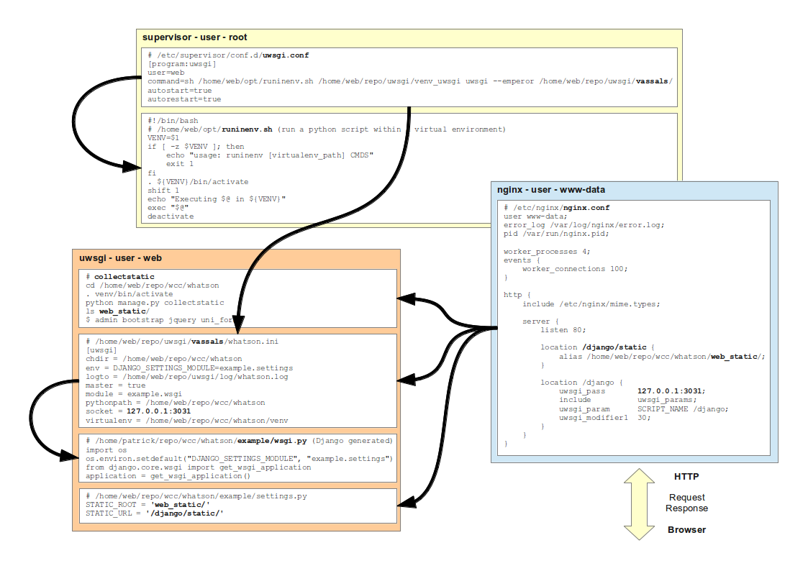

Supervisor
**********

Links
=====

- http://supervisord.org/
  Supervisor is a client/server system that allows its users to monitor and
  control a number of processes on UNIX-like operating systems.
- :doc:`snippets/supervisor-uwsgi`

Install
=======

Note: Better to install using ``apt-get`` rather than ``pip`` because then you
get all the ``init.d`` scripts::

  sudo apt-get install supervisor

Usage
=====

::

  sudo /etc/init.d/supervisor start

Test
----

To create a test application::

  sudo vim /etc/supervisor/conf.d/foo.conf

::

  [program:foo]
  command=/bin/cat

Control
=======

Start the shell (type ``help`` for help)::

  sudo supervisorctl

To list processes run ``status``::

  supervisor> status
  uwsgi                            RUNNING    pid 15435, uptime 0:27:13

Reload
------

I am not sure if this is correct, but try::

  supervisor> reread
  supervisor> update

  # or...
  supervisorctl update

Issues
======

::

  Starting supervisor:
  Error: Another program is already listening on a port that one of our HTTP
  servers is configured to use.

To solve this issue::

  sudo unlink /var/run/supervisor.sock
